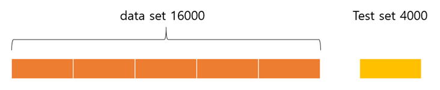
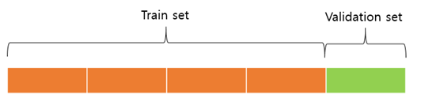
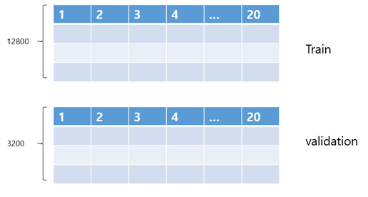
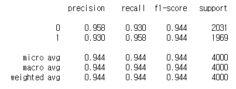
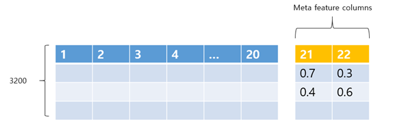
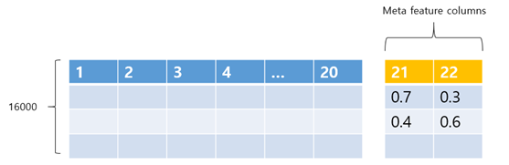
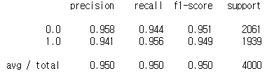

# Meta feature machine learning with scikit-learn


#### What is the meta feature learning?

Meta feature machine learning is one of technics to improve accuracy when you cannot raise accuracy more. Especially, this technic is for competition since accuracy improvement is tiny.


### 1. Normal procedure of Cross-validation with RandomForest


Le'ts generated 200000 rows artificial data with 2 classes and 20 features using scikit-learn function. 





Let's divide the data set one to Train and Validation set







**I used RandomForest classification to classify this data.  5 cross-validational Grid search is used to find best tune parameters. **

```python


from sklearn.ensemble import RandomForestClassifier
from sklearn.datasets import make_classification
from sklearn.model_selection import train_test_split
from sklearn.metrics import classification_report
from sklearn.model_selection import GridSearchCV

import pandas as pd

## Data Load
def data_load():
    X, y = make_classification(n_samples=20000, n_features=20, n_informative=12, n_redundant=0,random_state=0)
    return X,y

## RandomForest Grid search
def rf_train(x_train,y_train):
    n_estimators = [100,300,500,700,900,1000]
    max_depth = [10,20,30,40,50]
    random_grid = {'n_estimators': n_estimators,               
                   'max_depth': max_depth,
                  }
    rf = RandomForestClassifier(random_state=0)
    rf_random=GridSearchCV(estimator = rf, param_grid  = random_grid, cv = 5, verbose=2,  n_jobs = 2, scoring='f1')
    rf_random.fit(x_train, y_train)
    return rf_random

X,y=data_load()
x_train, x_test , y_train, y_test = train_test_split(X ,y, test_size=0.2 , random_state=0)
rf_random = rf_train(x_train,y_train)
```


**After parameter tuning, RF model fit whole training set using the best parameter, and tested the test set**


```python

rf_final = RandomForestClassifier(random_state=0, n_estimators=rf_random.best_params_['n_estimators'], max_depth=rf_random.best_params_['max_depth'])
rf_final.fit(x_train, y_train)

def evaluate(model,x_test,y_test):
    pred=model.predict(x_test)
    print(classification_report(pred,y_test,digits=3))


evaluate(rf_random.best_estimator_, x_test, y_test)

```



###### **f1-score is 0.944**


### 2. meta feature machine learning with RandomForest

But this time, when cross validate, added 2 features(the number of classes) which are prediction probability.





After all cross validation we can have **all the dataset with added 2 features.**





Actually, when adding 2 features, I also used best RF estimator with cross-validation.


This above whole process was by below codes.


```python
def harmonic_f1(pred,target,num_class):
    from sklearn.metrics import f1_score
    f1_result=f1_score(pred,target,average=None)
    f1_total= (num_class*2) /sum([2/(i) for i in f1_result])
    return f1_total, f1_result

def stacking_cv(X,y,n_estimators,max_depth):
    skfolds = StratifiedKFold(n_splits=5, random_state=0,shuffle=True)
    X_train, X_test, y_train, y_test = train_test_split(X, y, test_size=0.2, random_state=0)
    
    RF_dict={}
    cnt=0
    f1_acc=0
    
    x_train_meta = pd.DataFrame()
    y_train_meta = np.array([])        
    
    for train_index, test_index in skfolds.split(X_train ,y_train):
        x_train2=X_train[train_index,:]
        x_valid2=X_train[test_index,:]
        
        y_train2=y_train[train_index]       
        y_valid2=y_train[test_index]    

        RF = RandomForestClassifier(random_state=0, n_estimators=n_estimators, n_jobs=4, max_depth=max_depth)
        RF.fit(x_train2,y_train2)

        ## save models
        RF_dict[cnt] = RF
        proba_meta=RF.predict_proba(x_valid2)   

        x_train_meta=pd.concat([x_train_meta,  (pd.DataFrame(np.c_[x_valid2, proba_meta])) ] ,axis=0 ,ignore_index=True)
        y_train_meta=np.append(y_train_meta,y_valid2)
        
        f1_acc+=harmonic_f1(RF.predict(x_valid2),y_valid2,2)[0]
        cnt+=1
    
    print('n_estimators',n_estimators,'max_depth',max_depth,'f1',f1_acc/5)    
    return RF_dict, x_train_meta, y_train_meta, [n_estimators,max_depth,f1_acc/5]

scores=[stacking_cv(x_train,y_train,n_estimators,max_depth)[3] for max_depth in [None,10,20,30,40,50] for n_estimators in [100,300,500,700,900] ]
best_n_estimator, best_max_depth, _ =sorted(scores,key=lambda x : x[2], reverse=True)[0]
RF_dict, x_train_meta , y_train_meta, _=stacking_cv(x_train,y_train,best_n_estimator,best_max_depth)


```


######  I did cross-validation again using this new data set to find best parameter, 

```python
def rf_train(x_train,y_train):
    n_estimators = [100,300,500,700,900,1000]
    max_depth = [10,20,30,40,50]
    random_grid = {'n_estimators': n_estimators,               
                   'max_depth': max_depth,
                  }
    rf = RandomForestClassifier(random_state=0)
    rf_GS=GridSearchCV(estimator = rf, param_grid  = random_grid, cv = 5, verbose=2,  n_jobs = 2, scoring='f1')
    rf_GS.fit(x_train, y_train)
    return rf_GS

rf_GS = rf_train(x_train_meta,y_train_meta)

```

And again fit whole dataset using the best parameter

```python
rf_final = RandomForestClassifier(random_state=0, n_estimators=rf_GS.best_params_['n_estimators'], max_depth=rf_GS.best_params_['max_depth'])
rf_final.fit(x_train_meta, y_train_meta)
```


**Finally,  using final RF model,  evaluated the test set. But!! before that, we have to also add 2 features to test set using previous RF model which is used for adding 2 features**

> the number of the RF model for adding feature was 5, so I used this all 5 models to add 2 features to the test set by averaging all probability.

```python
proba_meta=np.sum([RF_dict[i].predict_proba(x_test) for i in range(len(RF_dict))],axis=0)/ len(RF_dict)
x_test_meta = pd.DataFrame(np.c_[x_test,proba_meta])
evaluate(rf_final,x_test_meta,y_test)
```





**Interestingly, F1 score is increased.** 